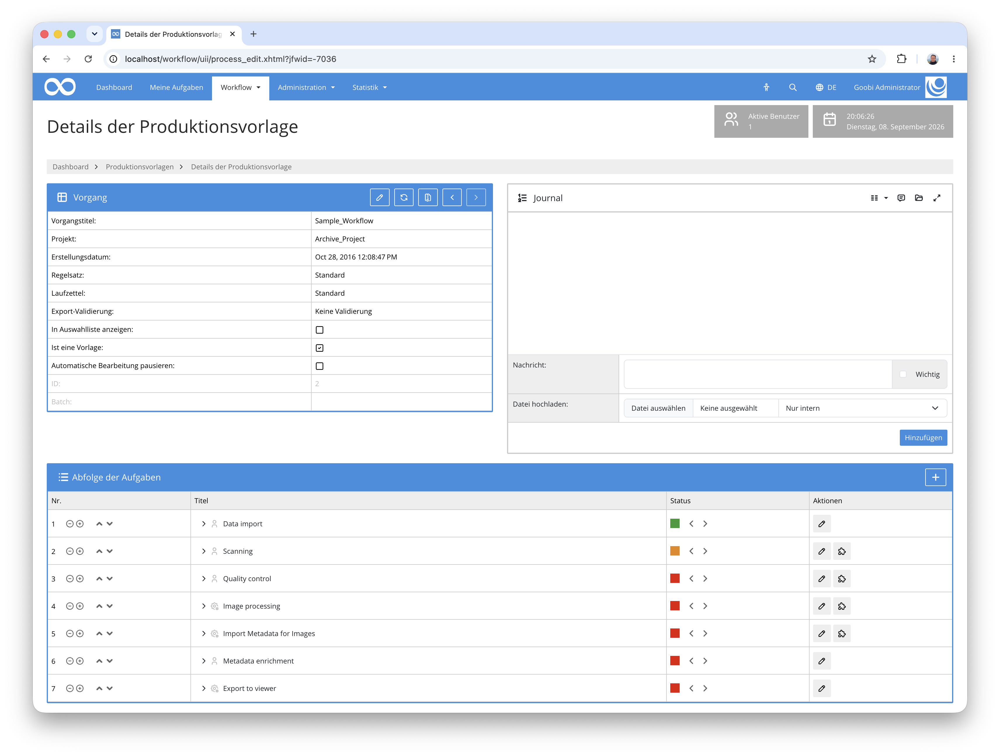
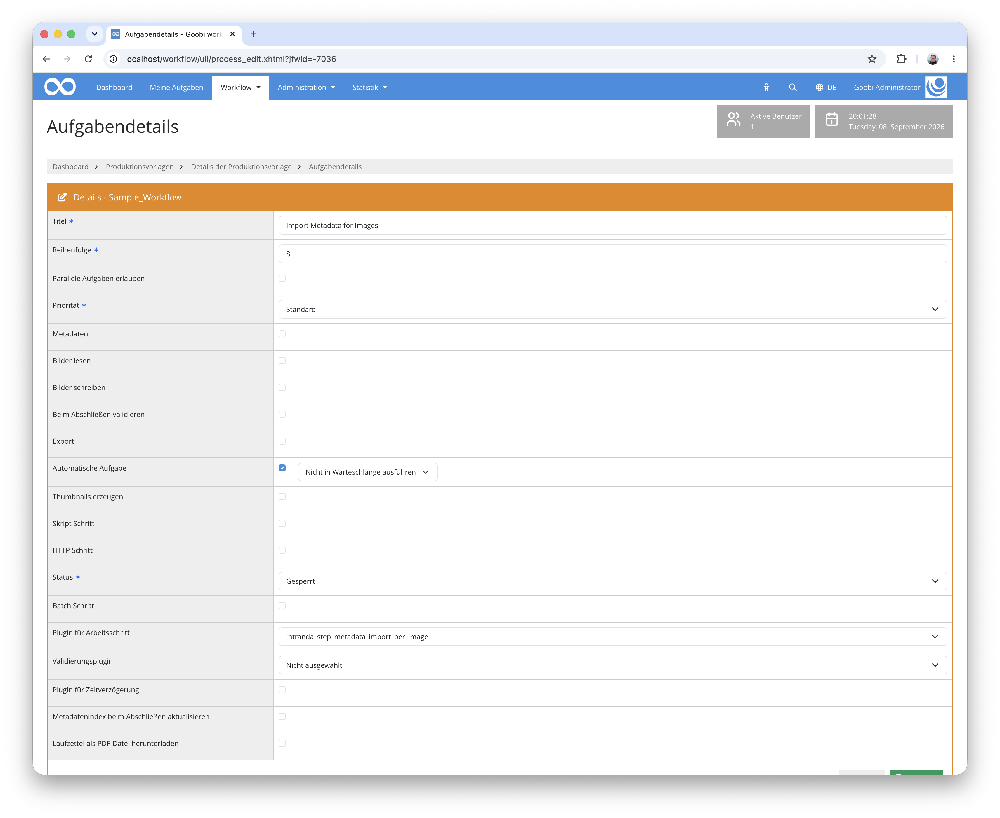

## Einführung
Dieses Step-Plugin liest eine Excel-Datei ein, die für jedes Bild eines Vorgangs genau eine Zeile enthält, und erzeugt daraus die logische Strukturhierarchie in der `meta.xml`. Aus konfigurierten Spalten entstehen dabei Strukturelemente wie Kapitel oder Abbildungen, denen die zugehörigen Seiten zugeordnet werden. Zusätzlich lassen sich weitere Spalten als Metadaten übernehmen und eine Spalte als Seitenbezeichnung auf die physischen Seiten schreiben.

Das Plugin besitzt keine eigene Oberfläche und läuft vollautomatisch als Arbeitsschritt.


## Installation
Um das Plugin nutzen zu können, müssen folgende Dateien installiert werden:

```bash
/opt/digiverso/goobi/plugins/step/plugin-step-metadata-import-per-image-base.jar
/opt/digiverso/goobi/config/plugin_intranda_step_metadata_import_per_image.xml
```

Nach der Installation des Plugins kann dieses innerhalb des Workflows für die jeweiligen Arbeitsschritte ausgewählt und somit automatisch ausgeführt werden. Ein Workflow könnte dabei beispielhaft wie folgt aussehen:



Für die Verwendung des Plugins muss dieses in einem Arbeitsschritt ausgewählt sein:



Da das Plugin keine Oberfläche besitzt, sollte der Arbeitsschritt als automatischer Schritt konfiguriert werden.


## Überblick und Funktionsweise
Beim Start des Arbeitsschritts durchläuft das Plugin die folgenden Schritte:

1. Die `meta.xml` des Vorgangs wird gelesen und die Konfiguration gegen den Regelsatz geprüft.
2. Die Paginierung wird angelegt, sofern noch nicht vorhanden. Der Aufruf ist wiederholbar und verändert bestehende Seiten nicht.
3. Der Pfad zur Excel-Datei wird aufgelöst. Goobi-Variablen wie `{importpath}` oder `{processpath}` sind dabei erlaubt.
4. Die Excel-Datei wird eingelesen und gegen die Bilder im Master-Ordner geprüft.
5. Von der `meta.xml` wird eine Sicherungskopie angelegt.
6. Die logische Struktur wird aufgebaut und die Seiten werden den erzeugten Elementen zugeordnet.

### Aufbau der Excel-Datei
Die erste Zeile der Tabelle ist die Kopfzeile mit den Spaltennamen, auf die sich die Konfiguration bezieht. Jede weitere Zeile beschreibt genau ein Bild, in derselben Reihenfolge, in der die Dateien im Master-Ordner alphabetisch sortiert vorliegen.

| Label | URI | Structure | Caption | Call Number | Studio Notes |
|---|---|---|---|---|---|
| [1] | https://archive.example.org/id/12345 | Correspondence | Letter to A. Meier | MS 4711 | recto |
| [2] | https://archive.example.org/id/12345 | Correspondence | Letter to A. Meier | MS 4711 | verso |
| 1 | https://archive.example.org/id/12345 | Photographs | Portrait, seated | MS 4712 | daylight |
| 2 | https://archive.example.org/id/12345 | Photographs | Portrait, standing | MS 4712 | daylight |

Die Gruppierung erfolgt über den Wechsel eines Wertes: Solange der Wert in der Spalte gleich bleibt, wachsen die betreffenden Seiten in dasselbe Strukturelement hinein. Ändert sich der Wert, so beginnt ein neues Element. Das Beispiel bezieht sich auf den ersten der oben gezeigten Konfigurationsblöcke. Aus ihm entsteht ein `ArchivalObject` — die Spalte `URI` bleibt durchgehend gleich —, darunter zwei `ArchivalFolder` (`Correspondence` und `Photographs`) und darin insgesamt drei `ArchivalItem`, von denen das erste zwei Seiten umfasst.

### Prüfungen vor dem Import
Das Plugin sammelt alle Probleme und bricht ab, bevor die `meta.xml` verändert wird. Zu einem Abbruch führen:

- Die Excel-Datei enthält keine Datenzeilen.
- Die Anzahl der Datenzeilen weicht von der Anzahl der Bilder im Master-Ordner ab.
- Die Anzahl der Datenzeilen weicht von der Anzahl der physischen Seiten in der `meta.xml` ab.
- Eine in der Konfiguration genannte Spalte fehlt in der Kopfzeile.
- Ein Gruppierungswert ist leer und für die Ebene ist kein `fallbackTitle` hinterlegt.
- Alle Gruppierungsspalten einer Zeile sind leer.
- Ein Zellwert enthält für XML unzulässige Steuerzeichen.
- Ein in der Konfiguration genannter Struktur- oder Metadatentyp ist im Regelsatz nicht vorhanden.

Als Warnung im Vorgangsjournal vermerkt, ohne den Import zu verhindern, werden:

- Ein bereits verwendeter Gruppierungswert taucht nach einer Unterbrechung erneut auf. In diesem Fall entstehen zwei getrennte Strukturelemente gleichen Namens.
- Die Arbeitsmappe enthält mehrere Tabellenblätter. Ausgewertet wird ausschließlich das erste.

### Umgang mit bereits vorhandener Struktur
Läuft der Schritt auf einem Vorgang, der bereits eine logische Struktur besitzt, so versucht das Plugin, vorhandene Elemente weiterzuverwenden, statt sie neu anzulegen.

Ist an einer Ebene das Attribut `matchMetadata` gesetzt, so wird ein vorhandenes Element anhand dieses Metadatums wiederverwendet. Wie verglichen wird, steuern `matchMode` und `matchDirection`. Ohne `matchMetadata` greift eine rein positionsbasierte Zuordnung: Es wird das erste noch nicht belegte Element des passenden Typs verwendet. Darauf weist das Plugin mit einer Warnung im Journal hin.

Elemente, die auf diesem Weg nicht wiederverwendet wurden, werden samt ihrer Seitenverknüpfungen entfernt. Bei wiederverwendeten Elementen bleiben die vorhandenen Metadaten unangetastet — die in der Konfiguration hinterlegten Felder `metadataField` und `<metadata>` werden ausschließlich auf neu angelegten Elementen gesetzt.


## Konfiguration
Die Konfiguration des Plugins erfolgt in der Datei `plugin_intranda_step_metadata_import_per_image.xml` wie hier aufgezeigt:

{{CONFIG_CONTENT}}

{{CONFIG_DESCRIPTION_PROJECT_STEP}}

Parameter               | Erläuterung
------------------------|------------------------------------
`excelFile`             | Pfad zur Excel-Datei im Format `.xlsx`. Goobi-Variablen werden ersetzt, etwa `{importpath}` für den Import-Ordner oder `{processpath}` für das Vorgangsverzeichnis.
`columnLabel`           | Name der Spalte, deren Wert als Seitenbezeichnung auf die physische Seite geschrieben wird. Voreinstellung ist `Label`.
`paginationLabelMetadata` | Metadatentyp, unter dem die Seitenbezeichnung abgelegt wird. Voreinstellung ist `logicalPageNumber`. Fehlt der Typ im Regelsatz, so werden die Seitenbezeichnungen übersprungen.
`hierarchy`             | Klammert die Ebenen der zu erzeugenden Struktur.
`level`                 | Eine Ebene der Hierarchie. Die Reihenfolge der Elemente bestimmt die Verschachtelung: die erste Ebene liegt direkt unter dem logischen Wurzelelement, jede weitere darunter.

Für die einzelnen Ebenen stehen die folgenden Attribute zur Verfügung:

Attribut                | Erläuterung
------------------------|------------------------------------
`structType`            | Name des Strukturtyps aus dem Regelsatz, der auf dieser Ebene angelegt wird. Der Typ muss unterhalb des jeweiligen Elternelements erlaubt sein.
`groupByColumn`         | Spalte, deren Wertwechsel den Beginn eines neuen Elements auslöst.
`metadataField`         | Metadatentyp, in den der Gruppierungswert als Wert geschrieben wird. Optional.
`fallbackTitle`         | Wert, der bei leerer Zelle verwendet wird. Ohne diese Angabe führt eine leere Zelle zum Abbruch. Optional.
`matchMetadata`         | Metadatentyp, über den vorhandene Elemente wiedererkannt werden. Ohne diese Angabe wird positionsbasiert zugeordnet. Optional.
`matchMode`             | Vergleichsart: `exact` (Voreinstellung), `startsWith`, `endsWith` oder `contains`.
`matchDirection`        | Richtung des Vergleichs: `metadataMatchesExcel` (Voreinstellung) prüft den Metadatenwert gegen den Excel-Wert, `excelMatchesMetadata` umgekehrt.

Innerhalb eines `level` können beliebig viele `<metadata>`-Elemente stehen, über die weitere Spalten als Metadaten übernommen werden:

Attribut                | Erläuterung
------------------------|------------------------------------
`column`                | Spalte, deren Wert übernommen wird. Verwendet wird der Wert aus der ersten Zeile der jeweiligen Gruppe.
`type`                  | Metadatentyp aus dem Regelsatz, unter dem der Wert abgelegt wird. Leere Werte werden übersprungen.

Bitte beachten Sie, dass sämtliche in der Konfiguration genannten Struktur- und Metadatentypen im Regelsatz des Vorgangs vorhanden sein müssen. Das Plugin prüft dies vor dem Import und bricht mit einer entsprechenden Meldung im Vorgangsjournal ab, wenn ein Typ fehlt.
