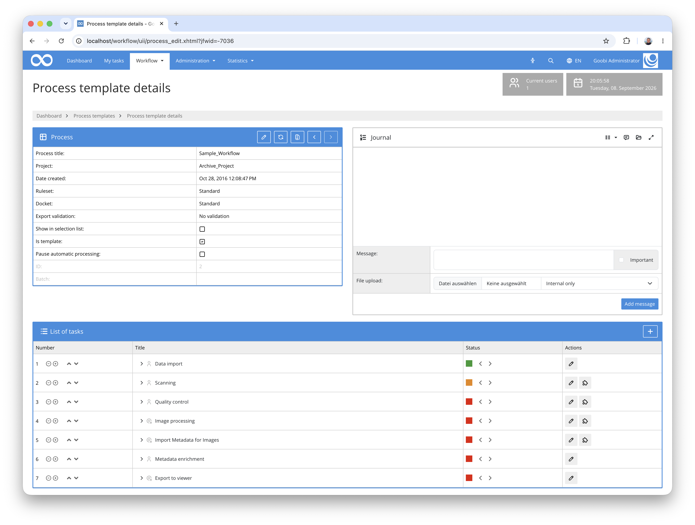
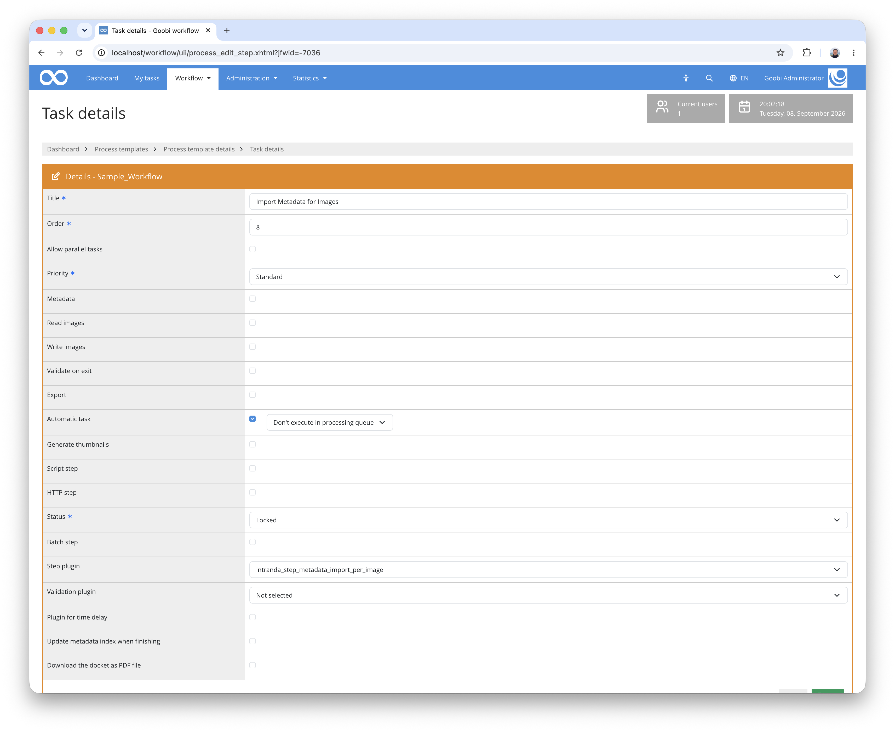

## Introduction
This step plugin reads an Excel file containing exactly one row per image of a process and builds the logical structure hierarchy in the `meta.xml` from it. Configured columns become structural elements such as chapters or figures, and the corresponding pages are assigned to them. Further columns can be imported as additional metadata, and one column can be written to the physical pages as their page label.

The plugin has no user interface of its own and runs fully automatically as a workflow step.


## Installation
To use the plugin, the following files must be installed:

```bash
/opt/digiverso/goobi/plugins/step/plugin-step-metadata-import-per-image-base.jar
/opt/digiverso/goobi/config/plugin_intranda_step_metadata_import_per_image.xml
```

Once the plugin has been installed, it can be selected for the relevant workflow steps and is then executed automatically. A workflow could, for example, look like this:



To use the plugin, it must be selected within a workflow step:



As the plugin has no user interface, the workflow step should be configured as an automatic step.


## Overview and Functionality
When the workflow step starts, the plugin performs the following steps:

1. The `meta.xml` of the process is read and the configuration is validated against the ruleset.
2. Pagination is created if it does not exist yet. The call is repeatable and leaves existing pages untouched.
3. The path to the Excel file is resolved. Goobi variables such as `{importpath}` or `{processpath}` may be used.
4. The Excel file is read and validated against the images in the master folder.
5. A backup copy of the `meta.xml` is created.
6. The logical structure is built and the pages are assigned to the elements created.

### Structure of the Excel file
The first row of the sheet is the header row holding the column names the configuration refers to. Every further row describes exactly one image, in the same order in which the files appear in the master folder when sorted alphabetically.

| Label | URI | Structure | Caption | Call Number | Studio Notes |
|---|---|---|---|---|---|
| [1] | https://archive.example.org/id/12345 | Correspondence | Letter to A. Meier | MS 4711 | recto |
| [2] | https://archive.example.org/id/12345 | Correspondence | Letter to A. Meier | MS 4711 | verso |
| 1 | https://archive.example.org/id/12345 | Photographs | Portrait, seated | MS 4712 | daylight |
| 2 | https://archive.example.org/id/12345 | Photographs | Portrait, standing | MS 4712 | daylight |

Grouping is driven by a change of value: as long as the value in a column stays the same, the pages concerned are collected into the same structural element. When the value changes, a new element is started. The example refers to the first of the configuration blocks shown above. It produces one `ArchivalObject` — the `URI` column stays the same throughout — holding two `ArchivalFolder` elements (`Correspondence` and `Photographs`) and three `ArchivalItem` elements in total, the first of which spans two pages.

### Validation before the import
The plugin collects all problems and aborts before the `meta.xml` is modified. The following cause an abort:

- The Excel file contains no data rows.
- The number of data rows differs from the number of images in the master folder.
- The number of data rows differs from the number of physical pages in the `meta.xml`.
- A column named in the configuration is missing from the header row.
- A grouping value is empty and no `fallbackTitle` is configured for that level.
- All grouping columns of a row are empty.
- A cell value contains control characters that are invalid in XML.
- A structural or metadata type named in the configuration does not exist in the ruleset.

The following are recorded as warnings in the process journal without preventing the import:

- A grouping value that has been used before reappears after an interruption. In this case two separate structural elements of the same name are created.
- The workbook contains several sheets. Only the first one is processed.

### Handling of an existing structure
If the step runs on a process that already has a logical structure, the plugin tries to reuse existing elements instead of creating new ones.

If the `matchMetadata` attribute is set on a level, an existing element is reused based on that metadata field. How the comparison is carried out is controlled by `matchMode` and `matchDirection`. Without `matchMetadata`, purely positional matching is used: the first element of the matching type that is not yet in use is taken. The plugin records a warning in the journal when this happens.

Elements that were not reused in this way are removed together with their page references. For reused elements the existing metadata is left untouched — the configured `metadataField` and `<metadata>` entries are only applied to newly created elements.


## Configuration
The plugin is configured in the file `plugin_intranda_step_metadata_import_per_image.xml` as shown here:

{{CONFIG_CONTENT}}

{{CONFIG_DESCRIPTION_PROJECT_STEP}}

Parameter               | Description
------------------------|------------------------------------
`excelFile`             | Path to the Excel file in `.xlsx` format. Goobi variables are replaced, for example `{importpath}` for the import folder or `{processpath}` for the process directory.
`columnLabel`           | Name of the column whose value is written to the physical page as its page label. The default is `Label`.
`paginationLabelMetadata` | Metadata type the page label is stored in. The default is `logicalPageNumber`. If the type is missing from the ruleset, page labels are skipped.
`hierarchy`             | Wraps the levels of the structure to be created.
`level`                 | One level of the hierarchy. The order of the elements determines the nesting: the first level sits directly beneath the logical root element, each further one below its predecessor.

The following attributes are available for the individual levels:

Attribute               | Description
------------------------|------------------------------------
`structType`            | Name of the structure type from the ruleset that is created on this level. The type must be allowed beneath the respective parent element.
`groupByColumn`         | Column whose change of value starts a new element.
`metadataField`         | Metadata type the grouping value is written to. Optional.
`fallbackTitle`         | Value used when the cell is empty. Without it, an empty cell causes the import to abort. Optional.
`matchMetadata`         | Metadata type used to recognise existing elements. Without it, matching is positional. Optional.
`matchMode`             | Comparison strategy: `exact` (default), `startsWith`, `endsWith` or `contains`.
`matchDirection`        | Direction of the comparison: `metadataMatchesExcel` (default) tests the metadata value against the Excel value, `excelMatchesMetadata` the other way round.

Any number of `<metadata>` elements can be placed inside a `level` in order to import further columns as metadata:

Attribute               | Description
------------------------|------------------------------------
`column`                | Column whose value is imported. The value from the first row of the respective group is used.
`type`                  | Metadata type from the ruleset the value is stored in. Empty values are skipped.

Please note that all structure and metadata types named in the configuration must exist in the ruleset of the process. The plugin validates this before the import and aborts with a corresponding message in the process journal if a type is missing.
